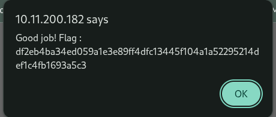

# 02 - Cookie_Tampering

## Walkthrough

1. The website sets a cookie named `I_am_admin` with this value:
	- `68934a3e9455fa72420237eb05902327`
2. This value looks like an hash. Crack it with CrackStation (https://crackstation.net/):
	- `68934a3e9455fa72420237eb05902327` -> `false`
3. Then hash `true` with MD5 (for example: https://www.md5hashgenerator.com/):
	- `true` -> `b326b5062b2f0e69046810717534cb09`
4. Replace the cookie value with this new hash and refresh the page.
5. The flag appears in an alert.

## Screenshot

