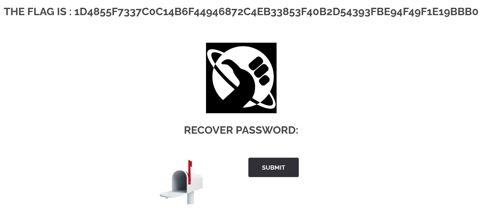

# 09 - Hidden_Field_Tampering
 
## Walkthrough
 
1. Go to the **Forgot Password** page of the website.
2. Open DevTools (`F12`) and inspect the form. You will find a hidden input field:
	- `<input type="hidden" name="mail" value="webmaster@borntosec.com" maxlength="15">`
3. Edit the `value` attribute directly in DevTools and replace it with any email address:
	- `webmaster@borntosec.com` -> `attacker@mail.com`
4. Click Submit. The server trusts the client-supplied value and sends the recovery link to the modified email.
5. The flag appears.
## Screenshot
 

 