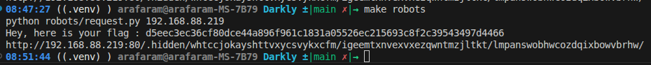

# 04 - Sensitive_Data_Exposure

## Walkthrough

1. Check the `robots.txt` file of the website. You will find a disallowed directory:
	- `/.hidden`
	- `robots.txt` is a public file used to tell search engine crawlers which paths should not be indexed. It is not a security control, but it often reveals interesting hidden routes during reconnaissance.
2. Navigate to `http://<address>/.hidden/`. The directory listing is open and contains hundreds of subdirectories.
3. Since browsing manually is impossible, run the script to crawl all subdirectories recursively and look for a `README` file containing the flag:
	- `python3 request.py <address>`
4. The script navigates through all nested folders until it finds a `README` with the flag inside.
5. The flag appears.

## Screenshot

