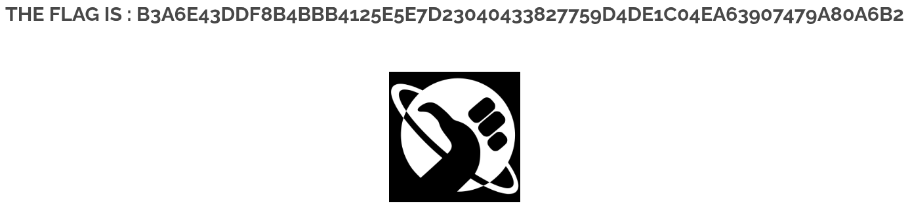

# 07 - Brute Force

## Walkthrough

### 1. Detect the Vulnerability

Navigate to the **login page** of the application. The form accepts a `username` and a `password`
with no visible rate-limiting, CAPTCHA, or account lockout mechanism — which confirms:
- The login endpoint is vulnerable to **brute force attacks**
- Credentials can be enumerated by repeatedly submitting requests

---

### 2. Capture the Request with Burp Suite

Open **Burp Suite** and navigate to the login page using the **built-in browser**.

1. Enter any dummy credentials and click **Login**
2. Go to **Proxy → HTTP History**
3. Find the login request and send it to **Intruder** (`Right click → Send to Intruder`)

The intercepted request should look like:

```
GET /index.php?page=signin&username=test&password=test&Login=Login HTTP/1.1
Host: <target>
```

---

### 3. Configure the Cluster Bomb Attack

In **Intruder**, select the **Cluster Bomb** attack type.
This mode iterates over **multiple payload sets independently**, testing every combination of username and password.

**Mark the injection points:**

```
GET /index.php?page=signin&username=§test§&password=§test§&Login=Login HTTP/1.1
```

- **Payload Set 1** → usernames list (position `§username§`)
- **Payload Set 2** → passwords list (position `§password§`)

> Cluster Bomb will try every combination of Payload Set 1 × Payload Set 2.

---

### 4. Load the Wordlists

Under **Payloads**:

| Payload Set | Type | Content |
|-------------|------|---------|
| 1 (username) | Simple list | Common usernames (e.g. `admin`, `root`, `user`, …) |
| 2 (password) | Simple list | Common passwords (e.g. `password`, `123456`, `shadow`, …) |

Start the attack by clicking **Start Attack**.

---

### 5. Identify the Valid Credentials

Once the attack completes, sort results by **Length** or **Status Code**.
A response with a different length or a `200 OK` with a success message indicates a valid login.

The valid credentials found are:

| Field | Value |
|-------|-------|
| Username | `root` |
| Password | `shadow` |

---

### 6. Extract the Flag

Log in using the discovered credentials:

- **Username:** `root`
- **Password:** `shadow`

The application returns the **flag** upon successful authentication.

---

## Summary

Capture login request from HTTP History → Configure Cluster Bomb in Burp Intruder → Load wordlists → Identify valid response → Log in → Get flag

---

## Screenshot

