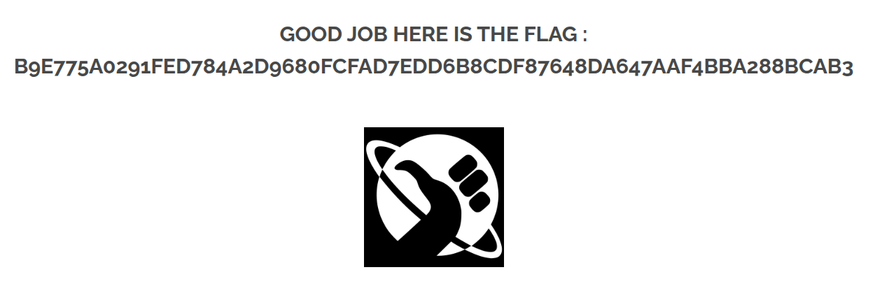

# 08 - Open Redirect

## Walkthrough

1. Inspect the page source or open DevTools (`F12`) and look at the social media icons in the footer.
   You will find links like:
   - `index.php?page=redirect&site=facebook`
   - `index.php?page=redirect&site=twitter`
   - `index.php?page=redirect&site=instagram`

2. The `site` parameter is passed directly to the server with no validation — the server blindly
   redirects to whatever value is provided.

3. Tamper the `site` parameter with an unexpected value:
   - `index.php?page=redirect&site=`

4. The server cannot resolve the redirect and leaks the flag in the response.

5. The flag appears.

## Screenshot

