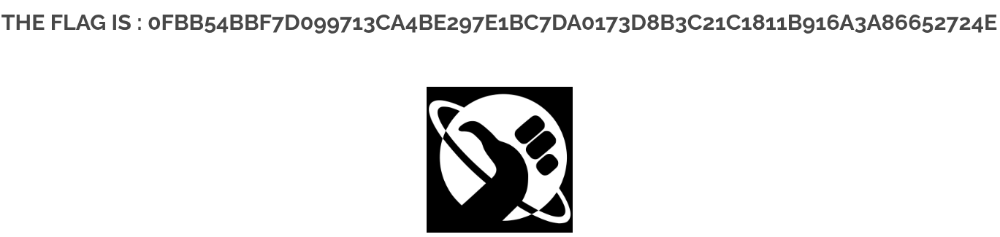

# 04 - XSS Stored

## Walkthrough

### 1. Detect the Vulnerability

Navigate to the **Leave Feedback** page of the application.
The form exposes two input fields:

- **Name** — the author of the feedback
- **Message** — the content of the feedback

The goal is to inject a persistent JavaScript payload that executes every time the page is visited.

---

### 2. Test the Message Field (Sanitized)

First, attempt to inject a basic XSS payload into the **Message** field:

```html
<script>alert(1);</script>
```

Nothing happens — the field is **sanitized server-side**, making it not injectable.

---

### 3. Test the Name Field (Vulnerable)

Try the same payload in the **Name** field:

```html
<script>alert(1);</script>
```

On the front-end, the field has a `maxlength` attribute that restricts input to **10 characters**:

```html
<input name="txtName" type="text" size="30" maxlength="10">
```

This client-side restriction prevents submitting the full payload directly from the browser.

---

### 4. Bypass the Client-Side Length Restriction

Open the browser **DevTools** (`F12`) and inspect the **Name** input field.
Manually change the `maxlength` attribute from `10` to `100`:

```html
<!-- Before -->
<input name="txtName" type="text" size="30" maxlength="10">

<!-- After -->
<input name="txtName" type="text" size="30" maxlength="100">
```

Now type the full payload into the **Name** field:

```html
<script>alert(1);</script>
```

Submit the form. An `alert(1)` pops up — confirming the **Name** field is vulnerable to XSS.

> This is a **client-side only** restriction. The server performs no length or content validation
> on the `Name` field, so bypassing `maxlength` in the DOM is enough to inject arbitrary JavaScript.

---

### 5. Understand Why It Is a Stored XSS

The injected script is **saved in the database** and rendered back on the page for every visitor.
This is what makes it a **Stored XSS** (also called Persistent XSS):

- The payload is not reflected once — it is **stored server-side**
- Every time the feedback page is loaded, the script **executes automatically**
- No user interaction or crafted link is needed

---

### 6. Extract the Flag

After submitting the payload with the modified `maxlength`, the alert fires.
However, the **flag does not appear** when `maxlength` is modified.

Revert the `maxlength` back to its **original value of `10`** in the DevTools,
then submit the form **without changing anything** — the flag appears directly on the page.

| Step | Action |
|------|--------|
| 1 | Inject `<script>alert(1);</script>` in the **Name** field |
| 2 | Modify `maxlength` from `10` → `100` to bypass the restriction |
| 3 | Submit → alert fires, but no flag |
| 4 | Restore `maxlength` to `10` and submit normally |
| 5 | Flag appears on the page |

---

## Summary

Test Message field (sanitized) → Test Name field → Bypass `maxlength` via DevTools → Confirm Stored XSS → Restore `maxlength` → Get flag

---

## Screenshot

