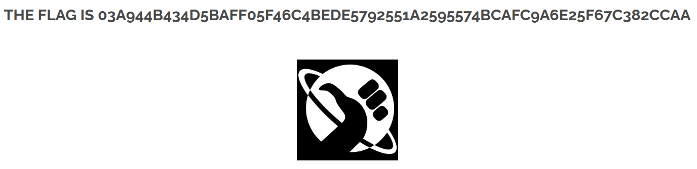

# 11 - Client-Side Validation Bypass

## Walkthrough

1. Navigate to the **Survey** page of the website.
2. Open DevTools (`F12`) and inspect the dropdown form. You will find a `<select>` element
   with values ranging from `1` to `10`:
   - `<option value="1">1</option>`
   - `<option value="10">10</option>`
3. The form uses `onchange="javascript:this.form.submit();"` — it submits automatically
   when a value is selected. The validation only exists client-side (in the browser).
4. Edit any `value` attribute directly in DevTools and replace it with a number greater than `10`:
   - `<option value="5">5</option>` → `<option value="99">5</option>`
5. Click the modified option. The server receives the value without any server-side validation
   and triggers the flag.
6. The flag appears.

## Screenshot

