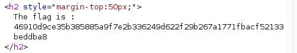

# 11 - File Upload

## Walkthrough

### 1. Detect the Vulnerability

Navigate to the **Add Image** page of the application.
The form allows users to upload an image file.

When uploading a file that is **not an image**, the server returns:

```
Your image is not uploaded
```

This tells us the server is performing some kind of file type validation — but the question is:
**where and how** is it validated?

---

### 2. Understand the Validation Weakness

The server only checks the **`Content-Type`** header sent by the client to determine if the file is an image.
It accepts **only** `image/jpeg` and rejects everything else.

> This is a critical mistake — the `Content-Type` header is entirely controlled by the client.
> The server **blindly trusts** what the client declares, without inspecting the actual file content.

---

### 3. Intercept the Request with Burp Suite

Open **Burp Suite** and use the **built-in browser** to navigate to the **Add Image** page.

1. Select **any non-image file** (e.g. a `.php` script or a `.pdf`) and submit the form
2. Go to **Proxy → HTTP History**
3. Find the upload request and send it to **Repeater** (`Right click → Send to Repeater`)

The intercepted request will contain a `Content-Type` that reflects the real file type:

```
Content-Disposition: form-data; name="uploaded"; filename="shell.php"
Content-Type: application/octet-stream
```

---

### 4. Forge the Content-Type Header

In **Repeater**, manually change the `Content-Type` of the file part from its real type to:

```
Content-Type: image/jpeg
```

So the modified request body looks like:

```
Content-Disposition: form-data; name="uploaded"; filename="shell.php"
Content-Type: image/jpeg
```

Click **Send**.

The server now accepts the file because it trusts the `Content-Type` header provided by the client —
without verifying the actual file content or extension.

---

### 5. Extract the Flag

The server processes the forged request as a valid image upload and returns the **flag** directly in the response.

| Field | Value |
|-------|-------|
| Uploaded file | Any non-image file (`.php`, `.pdf`, script, …) |
| Real Content-Type | `application/octet-stream` / `application/pdf` / etc. |
| Forged Content-Type | `image/jpeg` |
| Server response | **Flag** |

---

### 6. Why This Works

The vulnerability exists because:

- The server **never inspects the file's actual content** (magic bytes, file signature)
- The server **never validates the file extension**
- It relies **entirely on the `Content-Type` header**, which is a client-supplied value
- Any attacker can spoof this header trivially using a proxy like Burp Suite

A proper fix would involve server-side validation of the actual file content
using magic bytes (e.g. `FF D8 FF` for JPEG) regardless of what the client declares.

---

## Summary

Upload a non-image file → Intercept in Burp HTTP History → Send to Repeater → Forge `Content-Type: image/jpeg` → Send → Get flag

---

## Screenshot

