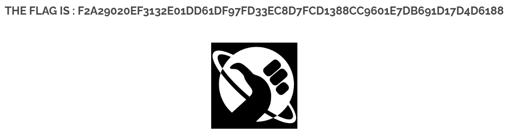

# 12 - HTTP Header Manipulation

## Walkthrough

### 1. Detect the Vulnerability

Navigate to the **main page** of the application and click on the **© BornToSec** link.
The page loads but does not reveal any flag directly.

Open the browser **DevTools** (`F12`) and inspect the page source.
Hidden inside **HTML comments**, two hints are revealed:

```html
<!--
Let's use this browser : "ft_bornToSec". It will help you a lot.
-->
```

```html
<!--
You must come from : "https://www.nsa.gov/".
-->
```

These comments tell us exactly what the server expects before granting access:
- A specific **User-Agent** value
- A specific **Referer** value

---

### 2. Understand the Validation Weakness

The server checks two HTTP request headers to decide whether to serve the flag:

| Header | Expected Value |
|--------|---------------|
| `User-Agent` | `ft_bornToSec` |
| `Referer` | `https://www.nsa.gov/` |

Both headers are **entirely client-controlled** — any user can forge them freely.
Relying on them for access control is a critical security mistake.

---

### 3. Forge the Headers with ModHeader

Install the **ModHeader** browser extension and create two rules:

**Rule 1 — Override the User-Agent:**
```
User-Agent: ft_bornToSec
```

**Rule 2 — Add the Referer:**
```
Referer: https://www.nsa.gov/
```

Enable the rules and reload the **© BornToSec** page.

---

### 4. Extract the Flag

With both headers forged, the server validates the request and returns the **flag** directly on the page.

| Header | Forged Value |
|--------|-------------|
| `User-Agent` | `ft_bornToSec` |
| `Referer` | `https://www.nsa.gov/` |

---

### 5. Why This Works

The vulnerability exists because:

- The server uses `User-Agent` to identify the browser/client — **fully client-controlled**
- The server uses `Referer` to check where the request comes from — **fully client-controlled**
- Neither header can be trusted for authentication or access control
- Any attacker can spoof them in seconds using a browser extension or a proxy like Burp Suite

A proper fix would use **server-side session authentication** instead of trusting client-supplied headers.

---

## Summary

Inspect page source → Find hints in HTML comments → Forge `User-Agent: ft_bornToSec` and `Referer: https://www.nsa.gov/` via ModHeader → Reload page → Get flag

---

## Screenshot

